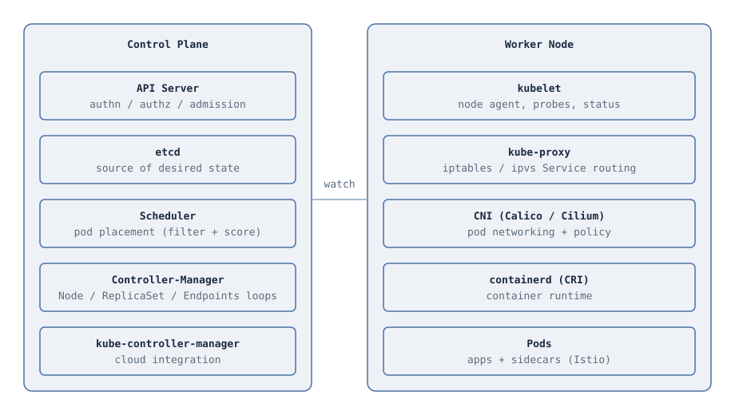

# Assets

Images and static resources used across the repository.

## Purpose

Store images, logos, and downloadable resources referenced by the documentation. Keeping assets in one place keeps the docs clean and links predictable.

## Conventions

- Organize by module: `01-fundamentals/`, `02-architecture/`, and so on
- Prefer SVG where possible for diagrams and illustrations
- Use descriptive kebab-case file names
- Keep file sizes small for fast cloning

## Assets

Images organized by module.

| File | Covers |
|------|--------|
| [02-architecture/control-plane.svg](02-architecture/control-plane.svg) | Control plane and worker node component diagram |
| [10-gitops/gitops-argocd.svg](10-gitops/gitops-argocd.svg) | GitOps pull model with ArgoCD |

## Usage in Markdown

```markdown

```

[Back to Repository Home](../README.md)
